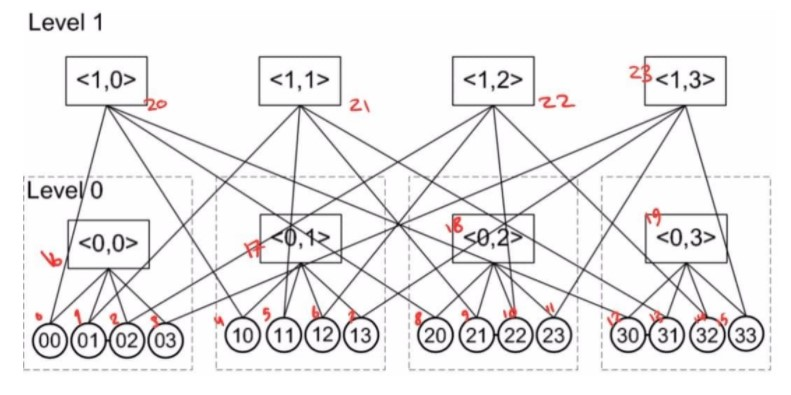

# Bcube-Topology

 
  <b>This project is related to the cloud computing course of Shahid Beheshti University.</b> 
 

 
We have some important topologies in datacenters such as Fat-Tree Bcube and Dcell. this app connects the servers(racks) to the switches and also switches to switches. We named the servers and swithces as the picture above. it entitled the the down-left most server to zero(0) and then go through to left step by step until reach the end of first level and give them ascending number. Then it goes to upper level and do this again. so every emelent(server and swithes) have a unique number. if there is a connection between two element it would print 1 and if there is no connection it would prints 99999.  
 <pre> 0   16     1  </pre>
  
 this code check every possible state so it writes the reverse of the above:
 
<pre> 16   0   1</pre>
 
 A topology with N element will print out all N^2 states.
 
For BCube we have two element which are K and n . K shows levels and n is the number of each switch's ports.
 

 
It print out the output in terminal and a file (Connection.txt).
 
By executing the Bcube.exe file and entering the K and n values, the output file is generated.
